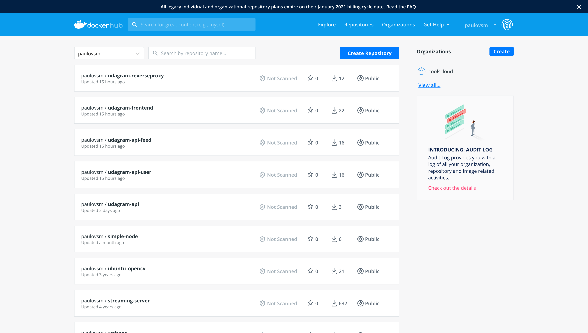
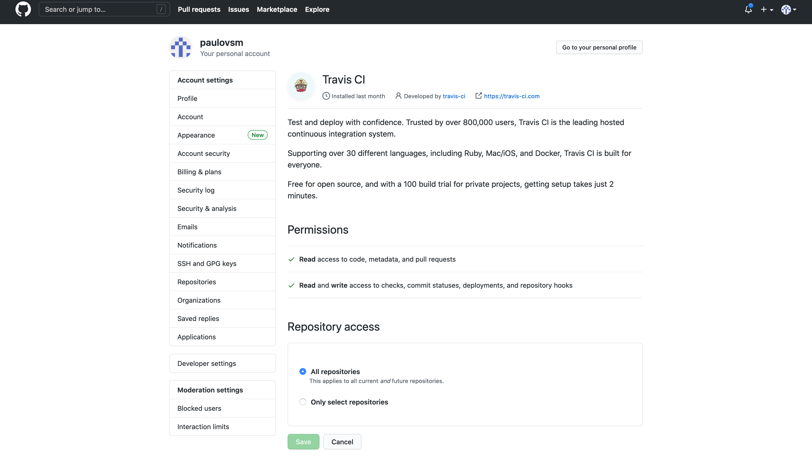
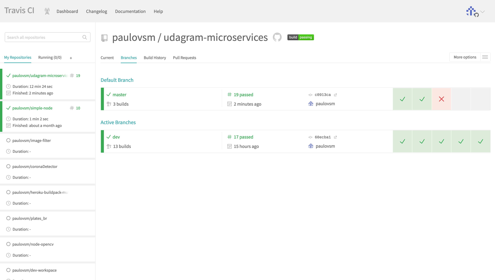
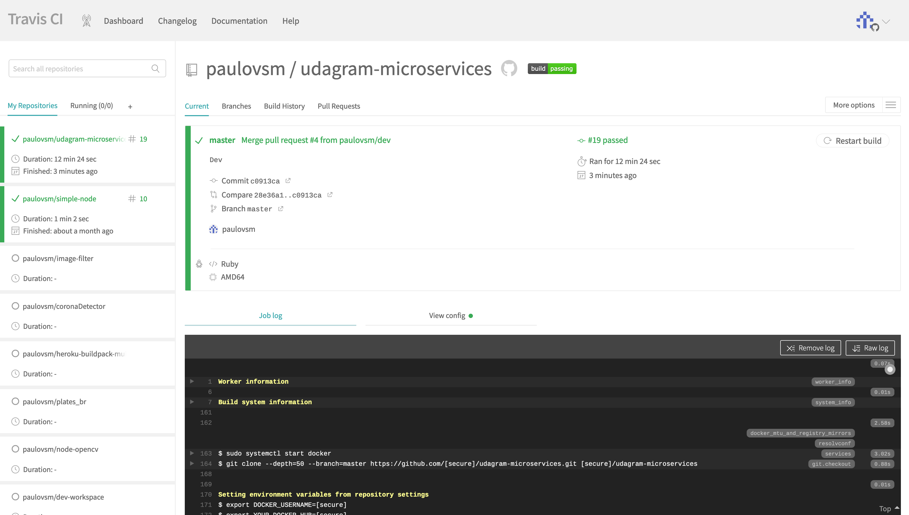
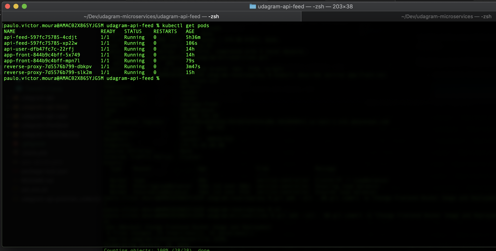
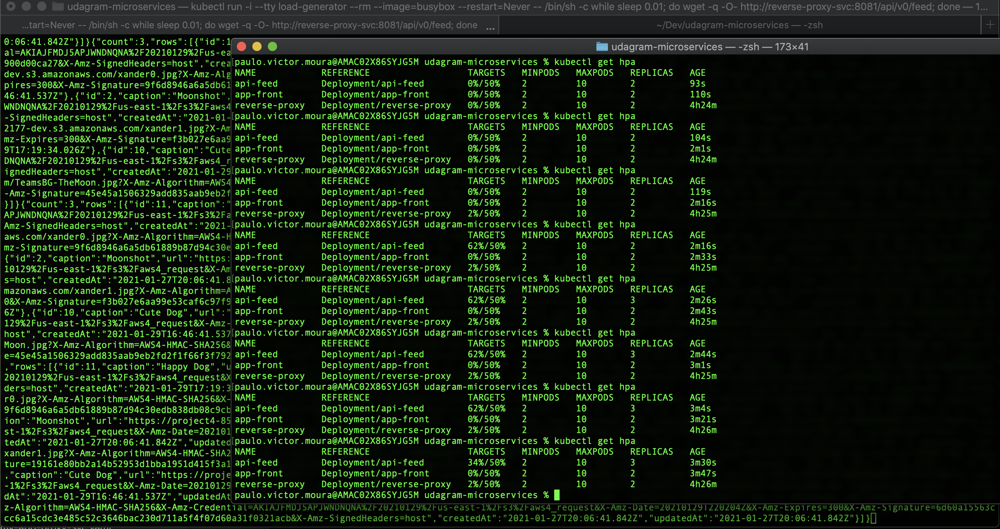
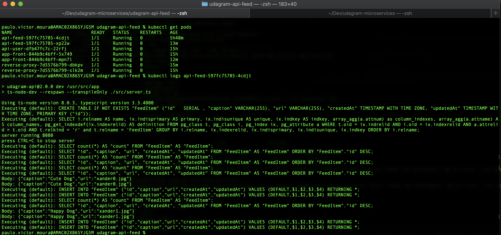
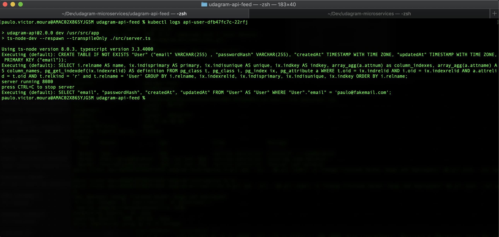
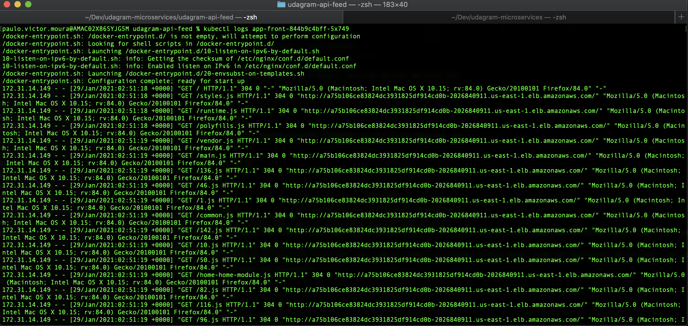
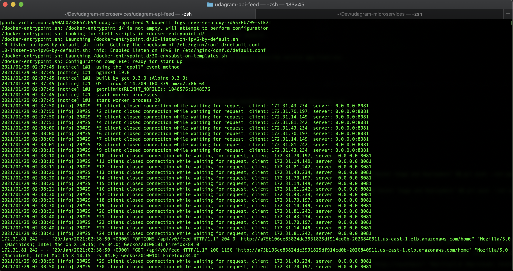

# Screenshots
To help review your infrastructure, please include the following screenshots in this directory::

## Web Application URL
* http://a75b106ce83824dc3931825df914cd0b-2026840911.us-east-1.elb.amazonaws.com/

## Deployment Pipeline
* DockerHub showing containers that you have pushed

* GitHub repository’s settings showing your Travis webhook (can be found in Settings - Webhook)

* Travis CI showing a successful build and deploy job



## Kubernetes
* To verify Kubernetes pods are deployed properly
```bash
kubectl get pods
```


* To verify Kubernetes services are properly set up
```bash
kubectl describe services
```


* To verify that you have horizontal scaling set against CPU usage
```bash
kubectl describe hpa
```


HPA responding under Load Generator load


* To verify that you have set up logging with a backend application

Feed API Service Logs
```bash
kubectl logs api-feed-597fc75785-4cdjt
```


User API Service Logs
```bash
kubectl logs api-user-dfb47fc7c-22rfj
```


Frontend Service Logs
```bash
kubectl logs app-front-844b9c4bff-5x749
```


Reverse Proxy Logs
```bash
kubectl logs reverse-proxy-7d5576b799-slk2m 
```
